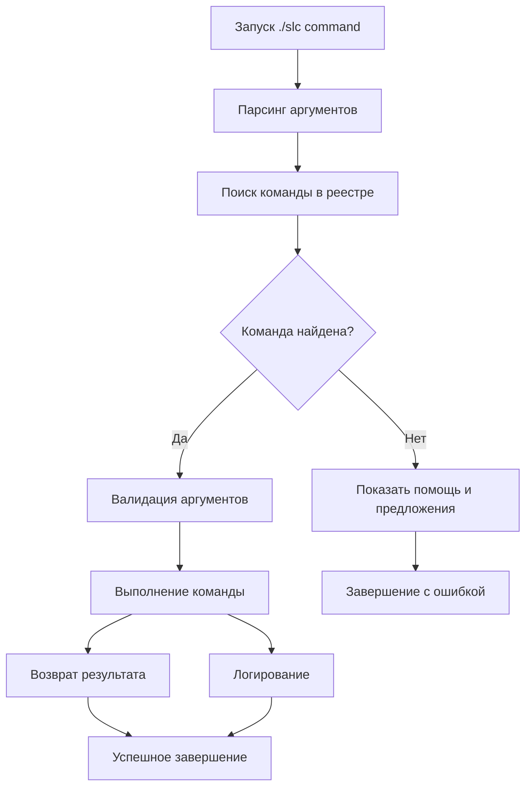

# Smart Layered Context - Архитектура CLI системы v2.0

## 🏗️ Обзор архитектуры

Smart Layered Context CLI v2.0 построена на **модульной архитектуре** с автоматическим обнаружением команд. Система обеспечивает масштабируемость, расширяемость и простоту поддержки.

---

## 📂 Структура файлов

```
.context/tools/
├── cli_modules/
│   ├── __init__.py                 # Инициализация модуля
│   ├── commands/                   # Директория команд
│   │   ├── __init__.py
│   │   ├── base_command.py         # Базовый класс команд
│   │   ├── core_commands.py        # Основные команды
│   │   ├── intelligent_commands.py # ИИ команды
│   │   ├── organization_commands.py# Команды организации
│   │   ├── context_commands.py     # Команды контекста
│   │   └── system_commands.py      # Системные команды
│   ├── core/
│   │   ├── __init__.py
│   │   ├── unified_context_engine.py # Движок контекста
│   │   ├── template_intelligence.py  # ИИ система шаблонов
│   │   └── file_organization.py      # Система организации файлов
│   └── utils/
│       ├── __init__.py
│       ├── file_utils.py           # Утилиты работы с файлами
│       ├── json_utils.py           # Утилиты JSON
│       └── logging_utils.py        # Система логирования
├── scripts/
│   └── slc_cli.py                  # Главный CLI скрипт
└── slc                             # Bash wrapper (executable)
```

---

## 🧱 Архитектурные компоненты

### 1. **Модульная система команд**

#### BaseCommand (базовый класс)
```python
# .context/tools/cli_modules/commands/base_command.py
class BaseCommand:
    """Базовый класс для всех CLI команд"""
    
    @property
    def name(self):
        """Имя команды для CLI"""
        raise NotImplementedError
    
    @property
    def description(self):
        """Описание команды"""
        raise NotImplementedError
    
    def execute(self, args):
        """Выполнение команды"""
        raise NotImplementedError
```

#### Автоматическое обнаружение команд
- Все команды наследуются от `BaseCommand`
- Автоматическая регистрация при загрузке модуля
- Динамическое подключение новых команд

### 2. **Единая точка входа**

#### CLI Router (`slc_cli.py`)
```python
def main():
    """Главная функция CLI"""
    # 1. Регистрация всех команд
    register_commands()
    
    # 2. Парсинг аргументов
    command, args = parse_arguments()
    
    # 3. Выполнение команды
    execute_command(command, args)
```

#### Bash Wrapper (`./slc`)
```bash
#!/bin/bash
# Удобная обёртка для CLI
python3 .context/tools/scripts/slc_cli.py "$@"
```

### 3. **Unified Context Engine (UCE)**

Центральная система управления контекстом:

```python
class UnifiedContextEngine:
    """Единый движок контекста СЛК"""
    
    def load_context(self, context_name):
        """Загрузка контекста по имени"""
        
    def load_files_content(self, files_list):
        """Загрузка содержимого файлов"""
        
    def analyze_context(self):
        """Анализ текущего контекста"""
        
    def optimize_context(self):
        """Оптимизация контекста"""
```

### 4. **Template Intelligence System**

ИИ-powered система рекомендаций:

```python
class TemplateIntelligence:
    """Система интеллектуальных рекомендаций"""
    
    def recommend_templates(self, query):
        """Рекомендации шаблонов на основе запроса"""
        
    def analyze_usage_patterns(self):
        """Анализ паттернов использования"""
        
    def generate_adaptive_template(self):
        """Генерация адаптивного шаблона"""
```

---

## ⚙️ Принципы работы

### 1. **Модульность и расширяемость**

#### Добавление новой команды:
1. Создать класс, наследующий `BaseCommand`
2. Реализовать required методы
3. Поместить в соответствующий файл в `commands/`
4. Команда автоматически зарегистрируется

```python
class MyNewCommand(BaseCommand):
    @property
    def name(self):
        return "my-command"
    
    @property  
    def description(self):
        return "Описание новой команды"
        
    def execute(self, args):
        # Логика команды
        pass
```

### 2. **Автоматическая регистрация**

```python
def register_commands():
    """Автоматическая регистрация всех команд"""
    commands = {}
    
    # Сканирование всех модулей команд
    for module in command_modules:
        for cls in get_command_classes(module):
            if issubclass(cls, BaseCommand):
                cmd = cls()
                commands[cmd.name] = cmd
    
    return commands
```

### 3. **Унифицированная обработка ошибок**

```python
def execute_command(command_name, args):
    """Выполнение команды с обработкой ошибок"""
    try:
        command = get_command(command_name)
        result = command.execute(args)
        return result
    except CommandNotFound:
        show_help_and_suggestions(command_name)
    except Exception as e:
        log_error(e)
        show_error_message(e)
```

---

## 🔄 Жизненный цикл команды



---

## 🧠 Интеллектуальные возможности

### 1. **Context-Aware рекомендации**

Система анализирует:
- Текущий контекст проекта
- Историю использования команд
- Паттерны работы пользователя
- Структуру файлов проекта

### 2. **Adaptive Template Generation**

```python
def generate_adaptive_template(self, context):
    """Генерация адаптивного шаблона"""
    
    # 1. Анализ паттернов использования
    patterns = self.analyze_usage_patterns()
    
    # 2. Определение потребностей контекста
    needs = self.analyze_context_needs(context)
    
    # 3. Генерация персонализированного шаблона
    template = self.create_template(patterns, needs)
    
    return template
```

### 3. **Smart File Organization**

```python
class FileOrganizer:
    """Интеллектуальная организация файлов"""
    
    def analyze_project_structure(self):
        """Анализ структуры проекта"""
        
    def suggest_improvements(self):
        """Предложения по улучшению"""
        
    def auto_organize(self, dry_run=True):
        """Автоматическая организация"""
```

---

## 📊 Система метрик и мониторинга

### 1. **Performance Metrics**

```python
class PerformanceMonitor:
    """Мониторинг производительности команд"""
    
    def track_command_execution(self, command, duration):
        """Отслеживание времени выполнения"""
        
    def analyze_performance_trends(self):
        """Анализ трендов производительности"""
        
    def suggest_optimizations(self):
        """Предложения по оптимизации"""
```

### 2. **Usage Analytics**

- Частота использования команд
- Популярные комбинации команд
- Эффективность рекомендаций
- Пользовательские паттерны

### 3. **Health Monitoring**

```python
def system_health_check():
    """Проверка здоровья системы"""
    checks = {
        'templates_integrity': check_templates_integrity(),
        'commands_availability': check_commands_availability(),
        'performance_metrics': check_performance_metrics(),
        'file_system_status': check_file_system_status()
    }
    return checks
```

---

## 🔧 Конфигурация и настройки

### 1. **Конфигурационные файлы**

```json
{
  "cli_config": {
    "version": "2.0.0",
    "performance": {
      "cache_enabled": true,
      "cache_ttl": 3600,
      "max_concurrent_operations": 5
    },
    "intelligence": {
      "recommendations_enabled": true,
      "learning_enabled": true,
      "adaptive_generation": true
    },
    "logging": {
      "level": "INFO",
      "file": ".slc/logs/cli.log",
      "max_size": "10MB"
    }
  }
}
```

### 2. **Environment Variables**

```bash
# Переменные окружения
SLC_DEBUG=1                 # Режим отладки
SLC_CONFIG_PATH=./config    # Путь к конфигурации
SLC_CACHE_DIR=./.slc/cache  # Директория кэша
SLC_LOG_LEVEL=DEBUG         # Уровень логирования
```

---

## 🚀 Оптимизации производительности

### 1. **Кэширование**

```python
class CacheManager:
    """Управление кэшем CLI"""
    
    def cache_command_result(self, command, args, result):
        """Кэширование результата команды"""
        
    def get_cached_result(self, command, args):
        """Получение кэшированного результата"""
        
    def invalidate_cache(self, pattern=None):
        """Инвалидация кэша"""
```

### 2. **Ленивая загрузка**

- Команды загружаются по требованию
- Шаблоны индексируются асинхронно
- Контекст загружается пошагово

### 3. **Асинхронные операции**

```python
async def load_templates_async():
    """Асинхронная загрузка шаблонов"""
    
async def analyze_context_async():
    """Асинхронный анализ контекста"""
```

---

## 🔐 Безопасность

### 1. **Валидация входных данных**

```python
def validate_command_args(command, args):
    """Валидация аргументов команды"""
    
    # Проверка типов
    # Санитизация путей
    # Проверка разрешений
    # Валидация форматов
```

### 2. **Ограничения доступа**

- Проверка прав доступа к файлам
- Ограничения на системные операции
- Песочница для выполнения команд

### 3. **Логирование безопасности**

- Отслеживание подозрительных операций
- Аудит изменений файлов
- Мониторинг производительности

---

## 📈 Планы развития архитектуры

### v2.1 - Улучшения производительности
- [ ] Полная асинхронность
- [ ] Улучшенное кэширование
- [ ] Оптимизация памяти

### v2.2 - Расширенная интеграция  
- [ ] Plugin система
- [ ] REST API интерфейс
- [ ] WebSocket для real-time операций

### v2.3 - ИИ улучшения
- [ ] Машинное обучение для рекомендаций
- [ ] Предиктивная загрузка контекста
- [ ] Автоматическая оптимизация команд

---

## 🛠️ Разработка и тестирование

### 1. **Среда разработки**

```bash
# Настройка dev окружения
python3 -m venv venv
source venv/bin/activate
pip install -r requirements-dev.txt
```

### 2. **Тестирование**

```python
# Пример unit теста
class TestCoreCommands(unittest.TestCase):
    def test_list_command(self):
        cmd = ListCommand()
        result = cmd.execute([])
        self.assertIsNotNone(result)
```

### 3. **CI/CD интеграция**

```yaml
# .github/workflows/cli-tests.yml
name: CLI Tests
on: [push, pull_request]
jobs:
  test:
    runs-on: ubuntu-latest
    steps:
      - uses: actions/checkout@v2
      - name: Test CLI commands
        run: python -m pytest tests/cli/
```

---

*Документация архитектуры обновлена: 16 января 2025 г.*
*Версия CLI: v2.0*
*Архитектурная версия: Модульная v2.0* 