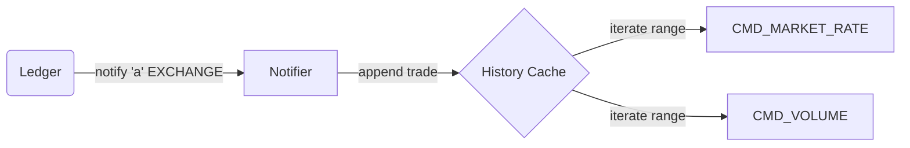
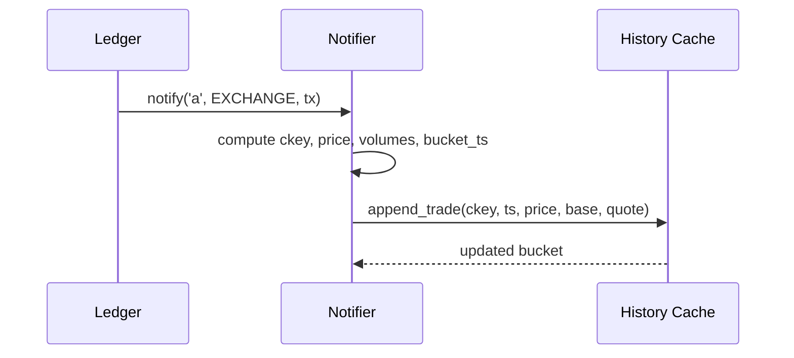
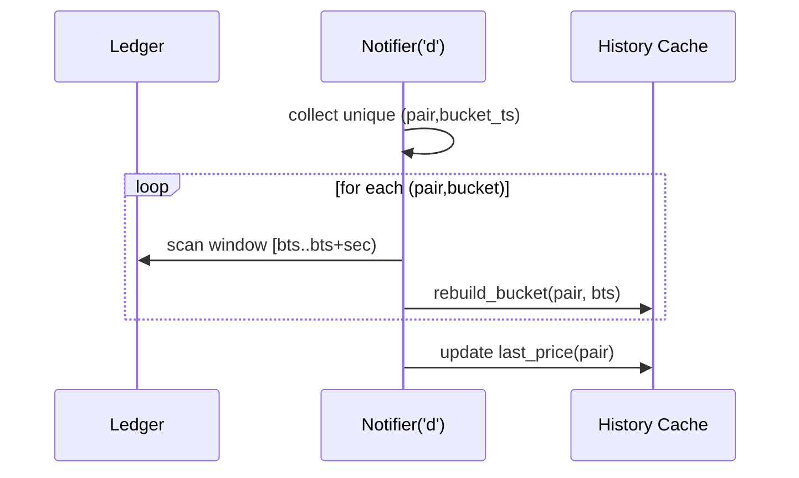

## DEX v2 — Исторический кэш (OHLCV)

Документ описывает устройство и работу исторического кэша DEX v2 (OHLCV), его структуру данных, алгоритмы записи и чтения, обработку reorg, параметры конфигурации, гарантийные свойства и эксплуатационные аспекты.

### Цели
- Быстрый ответ на команды `market_rate` и `volume` без полного сканирования леджера.
- Агрегация подтверждённых сделок (EXCHANGE) в временные «бакеты» с OHLCV.
- Минимальный оверхед на запись (append-only в обычном режиме) и локальный пересчёт при reorg.

### Ключевые понятия
- Каноническая пара: BASE/QUOTE с лексикографическим порядком `(net_id, ticker)`; цена всегда в QUOTE/BASE.
- Бакет (bucket): окно агрегации фиксированной длительности `bucket_sec`; ключ бакета — начало окна `ts = floor(tx_ts / bucket_sec) * bucket_sec`.
- OHLCV: Open, High, Low, Close цены по сделкам плюс объёмы `sum_base`, `sum_quote` и `trades`.

### Конфигурация
- `srv_dex.history_cache` (bool): включает/выключает исторический кэш.
- `srv_dex.history_bucket_sec` (uint32): размер временного бакета в секундах (по умолчанию 60).

### Структуры данных
- Топ-уровень: хеш-таблица пар `s_dex_history: { dex_pair_key_t -> dex_hist_pair_t }`.
- На пару: хеш-таблица бакетов `buckets: { ts -> dex_bucket_agg_t }`.
- Локи: RW‑лок `s_dex_history_rwlock` защищает всю структуру истории.

```mermaid
classDiagram
    class dex_pair_key_t {
        +sell_net_id
        +sell_token
        +buy_net_id
        +buy_token
    }
    class dex_bucket_agg_t {
        +open : uint256
        +high : uint256
        +low  : uint256
        +close: uint256
        +sum_base  : uint256
        +sum_quote : uint256
        +ts       : uint64 (bucket start)
        +first_ts : uint64
        +last_ts  : uint64
        +trades   : uint32
    }
    class dex_hist_pair_t {
        +key : dex_pair_key_t
        +buckets : {ts -> dex_bucket_agg_t}
        +last_price : uint256
    }
    dex_hist_pair_t o--> dex_bucket_agg_t
```

### Поток данных



### Запись (append) при подтверждённой сделке
1. Нотификатор `s_ledger_tx_add_notify_dex` на опкод `'a'` для `EXCHANGE`:
   - Для каждого `IN_COND`:
     - Находит предыдущий SRV_DEX‑оут (`prev`), вычисляет каноническую пару `ckey`, сторону (ASK/BID) и цену `price_canon`.
     - Определяет исполненный объём `executed_i` (с учётом резидуала в `OUT_COND`, если это `IN[0]`).
     - Проецирует объёмы в канон: `add_base` и `add_quote` (в зависимости от стороны).
     - Вычисляет `bucket_ts = floor(tx_ts / bucket_sec) * bucket_sec`.
     - Вызывает `dex_history_append_trade(ckey, ts, price, add_base, add_quote, bucket_sec)`.
2. `dex_history_append_trade` под WR‑локом:
   - Создаёт бакет, если отсутствует: `open = last_price?last_price:price`;
   - Обновляет `high/low`, `close`, суммарные объёмы и `trades`;
   - Обновляет `pair.last_price = price` (для корректного `open` следующего бакета).



### Чтение
Команды `market_rate` и `volume` при включённом `history_cache` и заданном `-bucket`:
- Используют итератор `dex_history_for_each_range(ckey, ts_from, ts_to, bucket_sec, cb, ctx)`.
- Итерируют равномерно по шагу `bucket_sec`, для каждого ключа `ts` делают `HASH_FIND` в парном бакет‑хеше.
- `market_rate` может заполнять отсутствующие «дыры» синтетическими свечами при `-fill` (open=high=low=close=последняя цена).

Сложность: O(k), где k — число бакетов в запрошенном диапазоне.

### Обработка reorg (‘d’)
1. В ‘d’‑ветке `EXCHANGE` для каждого `IN_COND` формируется ключ `(pair, bucket_ts)` и складывается во временную UTHash (дедупликация).
2. Для каждого уникального `(pair, bucket_ts)` вызывается `dex_history_rebuild_bucket`:
   - Сканирует леджер только в окне `[bucket_ts .. bucket_ts+bucket_sec-1]`.
   - Пересобирает агрегаты OHLCV для этой пары; если сделок нет — удаляет бакет.
3. После пересборок обновляется `last_price` пары: ищется бакет с максимальным `ts`, `last_price = close` этого бакета (если бакетов нет — остаётся как есть, обновится на добавлении следующей сделки).



Почему пересборка, а не «вычитание»: O/H/L/C не умеет «минусовать» корректно, если удаляемый трейд совпадал с open/close/min/max. Точечный перескан одного бакета даёт правильный результат и остаётся локальным по времени.

### Конкурентность
- Чтение: RD‑лок на весь кэш истории.
- Запись/пересборка: WR‑лок только на короткую секцию изменения одной пары/бакета; вычисления (нормализация пары, леджер‑итерирование) выполняются вне лока.

### Политика cross‑net
- `reject`: кросс‑нет сделки игнорируются в истории.
- `warn`: учитываются, но логируются предупреждением.

### Надёжность и корректность
- История формируется только из подтверждённых EXCHANGE‑транзакций, наличие выплаты продавцу в `buy_token` проверяется.
- Канонизация пары обеспечивает единый формат BASE/QUOTE, цена всегда QUOTE/BASE.
- Временная нормализация `bucket_ts` гарантирует детерминированное сопоставление сделок к бакету.

### Производительность
- Append: O(1) поиск/вставка бакета; микросекунды–миллисекунды.
- Read: O(k) по числу бакетов; быстро для типичных диапазонов.
- Reorg: O(n_window) по числу транзакций в окне одного бакета; reorg редок, дедупликация `(pair,bucket)` делает число пересборок минимальным.

### Границы и ограничения
- Для ответа без `-bucket` (`spot`, `vwap` за всё окно) текущая реализация может обращаться к леджеру (зависит от команды и флагов).
- История не хранит список транзакций в бакете (только агрегаты); при необходимости можно ввести опциональный индекс (увеличит RAM и сложность).

### Тюнинг
- `history_bucket_sec`: 
  - Меньше — точнее по времени, больше бакетов и пересборок при reorg, но более точные свечи.
  - Больше — меньше бакетов и пересборок, но более «грубая» агрегация.

### API (внутренние функции)
- `dex_history_append_trade(key, ts, price, qty_base, qty_quote, bucket_sec)` — добавить сделку в бакет.
- `dex_history_for_each_range(key, from, to, bucket_sec, cb, ctx)` — итерировать найденные бакеты в диапазоне.
- `dex_history_rebuild_bucket(ledger, key, bucket_ts, bucket_sec)` — пересобрать один бакет (reorg).

### Тест‑план (минимальный)
- Добавление сделок в один бакет: корректные O/H/L/C, суммы и `trades`.
- Переход через границу бакета: `open` следующего бакета = `last_price` пары.
- Reorg: удаление трейда, который был open/close/min/max — правильная пересборка.
- Reorg нескольких входов одной пары в одном бакете — пересборка ровно один раз (дедупликация).
- Cross‑net: поведение согласно политике.

### Трассировка и диагностика
- DEBUG‑логи в нотификаторе фиксируют параметры обработки и пересборки.
- Для профилирования можно добавить счётчики: количество пересборок, суммарное/последнее время.

---
Версия документа: 1.0
Диаграммы — формальные, отражают ключевые взаимодействия; фактический код — источник истины.


