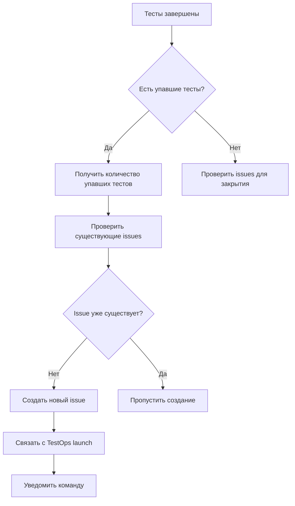
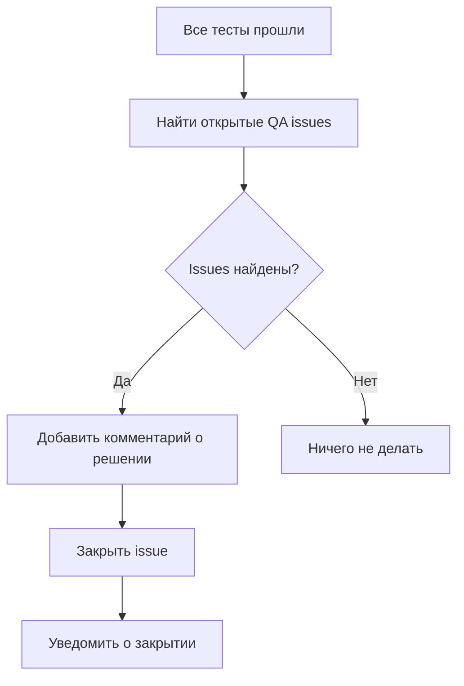

# 🐛 Автоматическое создание Issues для упавших тестов

## Обзор

Реализована система автоматического создания и управления GitLab issues для упавших тестов в рамках QA процесса Cellframe Node. Система интегрирована с Allure TestOps и GitLab CI/CD pipeline.

## Компоненты системы

### 1. Issue Manager (`issue_manager.sh`)

Основной компонент для управления issues:

**Функции:**
- ✅ Автоматическое создание issues для упавших тестов
- ✅ Закрытие issues при успешном прохождении тестов
- ✅ Проверка существующих issues (предотвращение дубликатов)
- ✅ Интеграция с GitLab API
- ✅ Связывание с TestOps launches

**Команды:**
```bash
./issue_manager.sh process <launch_id> [name] [version] [commit] [url]  # Создать issue для упавших тестов
./issue_manager.sh close-resolved <launch_id> [version]                 # Закрыть решенные issues
./issue_manager.sh list [limit]                                         # Список recent QA issues
./issue_manager.sh test-gitlab                                          # Тест GitLab подключения
```

### 2. Launch Manager Integration

Расширен `launch_manager.sh` новой командой:

```bash
./launch_manager.sh issues <id> [name] [version] [commit] [url]  # Обработка issues для launch
```

### 3. Конфигурация (`issue_config.env`)

```bash
# GitLab Configuration
export GITLAB_URL="https://gitlab.demlabs.net"
export GITLAB_PROJECT_ID="2"  # cellframe/cellframe-node
export GITLAB_TOKEN=""         # GitLab API token

# Issue Creation Settings
export CREATE_ISSUES_ON_FAILURE="true"
export CLOSE_ISSUES_ON_SUCCESS="true"
export ISSUE_LABELS="qa-failure,automated-issue,testing"
export MIN_FAILED_TESTS_FOR_ISSUE="1"
```

## Интеграция с GitLab CI

### Автоматическая обработка в Pipeline

В `.gitlab-ci.yml` добавлен шаг обработки issues:

```yaml
# Process issues (create for failures, close for successes)
echo ""
echo "=== Processing Issues ==="
./launch_manager.sh issues \
  "$(cat .launch_id 2>/dev/null || echo '')" \
  "${LAUNCH_NAME}" \
  "${NODE_VERSION_INFO}" \
  "${CI_COMMIT_SHORT_SHA}" \
  "${CI_PIPELINE_URL}"
```

### Артефакты

Добавлены в артефакты pipeline:
- `qa-tests/issue_manager.sh`
- `qa-tests/issue_config.env`

## Workflow автоматического создания Issues

### 1. При упавших тестах



### 2. При успешных тестах



## Формат создаваемых Issues

### Заголовок
```
QA: {количество} tests failed in {версия_ноды} ({commit_hash})
```

### Описание
```markdown
## 🐛 Автоматически созданная задача для упавших тестов

### 📊 Информация о запуске
- **Launch ID**: 26
- **Launch Name**: QA Tests - 14.10.2025_14:06
- **Failed Tests**: 1
- **Node Version**: latest-amd64
- **Commit**: abd339ee
- **Pipeline**: https://gitlab.demlabs.net/cellframe/cellframe-node/-/pipelines/123

### 🔗 Ссылки
- **TestOps Launch**: http://178.49.151.230:8080/launch/26
- **TestOps Project**: http://178.49.151.230:8080/project/1
- **GitLab Pipeline**: https://gitlab.demlabs.net/cellframe/cellframe-node/-/pipelines/123

### 📋 Действия для исправления
1. Проверить детали упавших тестов в TestOps
2. Проанализировать логи тестов
3. Определить причину падения
4. Исправить код или тесты
5. Запустить тесты повторно

### 🏷️ Метки
- `qa-failure`
- `automated-issue`
- `testing`
```

## Настройка GitLab API Token

### 1. Создание Personal Access Token

1. Перейти в GitLab: Settings → Access Tokens
2. Создать токен с правами:
   - `api` - полный доступ к API
   - `read_repository` - чтение репозитория
   - `write_repository` - запись в репозиторий

### 2. Настройка в CI/CD

Добавить переменную в GitLab CI/CD:
- Имя: `GITLAB_TOKEN`
- Значение: созданный токен
- Тип: `Variable` (protected)

### 3. Обновление конфигурации

```bash
# В issue_config.env
export GITLAB_TOKEN="${GITLAB_TOKEN}"  # Из CI/CD переменной
```

## Тестирование системы

### Локальное тестирование

```bash
cd qa-tests
./test_issue_system.sh
```

### Проверка компонентов

```bash
# Тест GitLab подключения
./issue_manager.sh test-gitlab

# Список recent issues
./issue_manager.sh list 10

# Создание тестового launch
./launch_manager.sh create "Test Launch" "test,demo"
```

## Мониторинг и логирование

### Логи в Pipeline

Система выводит подробные логи:
- ✅ Успешные операции (зеленый)
- ⚠️ Предупреждения (желтый)
- ❌ Ошибки (красный)
- 🔍 Отладочная информация (фиолетовый)

### Проверка статуса

```bash
# Текущий launch ID
./launch_manager.sh current

# Статистика launch
./launch_manager.sh stats

# Сравнение с предыдущим
./launch_manager.sh compare
```

## Преимущества системы

### 1. Автоматизация
- ✅ Автоматическое создание issues при падении тестов
- ✅ Автоматическое закрытие при исправлении
- ✅ Предотвращение дубликатов

### 2. Интеграция
- ✅ Полная интеграция с GitLab CI/CD
- ✅ Связь с Allure TestOps
- ✅ Трассируемость от теста до issue

### 3. Информативность
- ✅ Подробная информация в issues
- ✅ Прямые ссылки на TestOps и Pipeline
- ✅ Контекст для быстрого исправления

### 4. Управляемость
- ✅ Гибкая конфигурация
- ✅ Возможность отключения
- ✅ Настраиваемые метки и пороги

## Следующие шаги

### 1. Расширение функциональности
- [ ] Интеграция с Slack/Teams уведомлениями
- [ ] Автоматическое назначение ответственных
- [ ] Приоритизация issues по критичности

### 2. Аналитика
- [ ] Метрики по issues (время решения, частота)
- [ ] Dashboard с статистикой QA
- [ ] Тренды качества кода

### 3. Улучшения
- [ ] Шаблоны issues для разных типов ошибок
- [ ] Автоматическая категоризация проблем
- [ ] Интеграция с системой управления релизами

## Заключение

Система автоматического создания issues значительно улучшает процесс управления качеством:

- **Скорость реакции**: Мгновенное создание задач при обнаружении проблем
- **Прозрачность**: Полная видимость состояния QA процесса
- **Эффективность**: Автоматизация рутинных операций
- **Качество**: Снижение времени на исправление дефектов

Система готова к использованию и может быть легко расширена под специфические потребности проекта.

---
*Документ создан: 14.10.2025*  
*Автор: QA Automation System*  
*Версия: 1.0*
