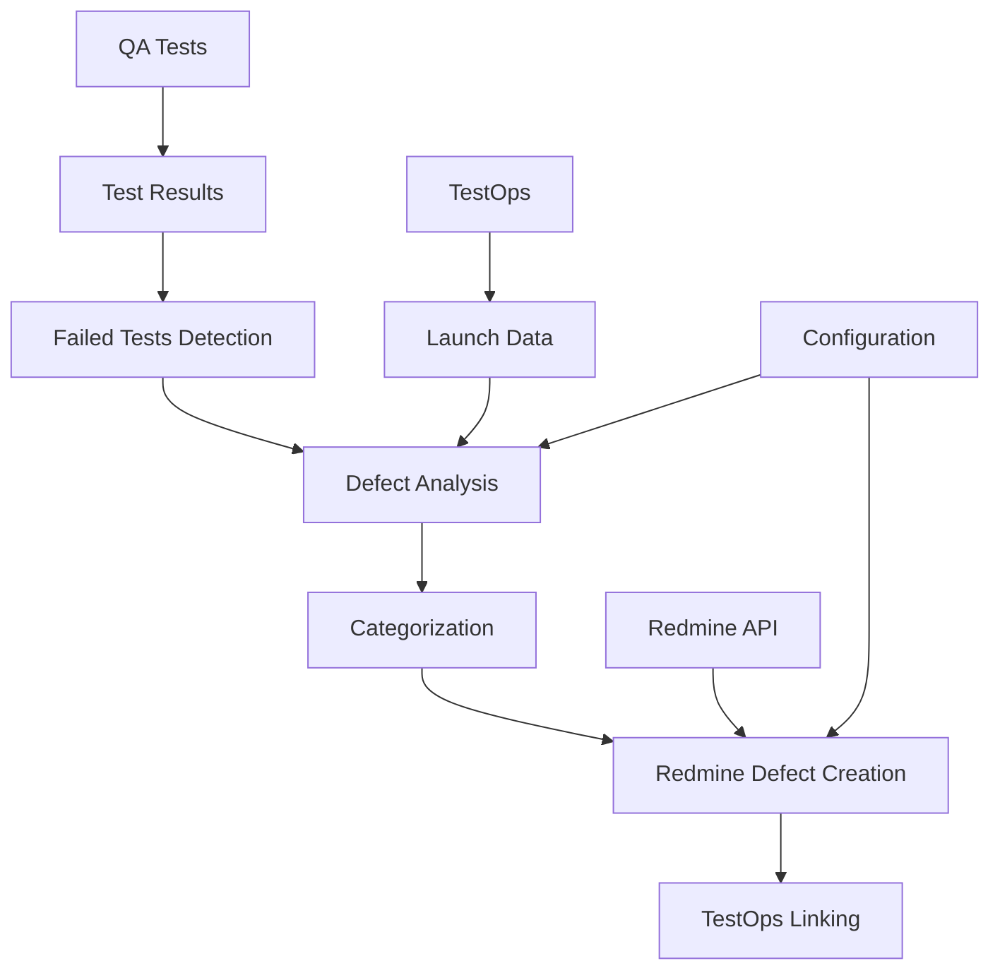
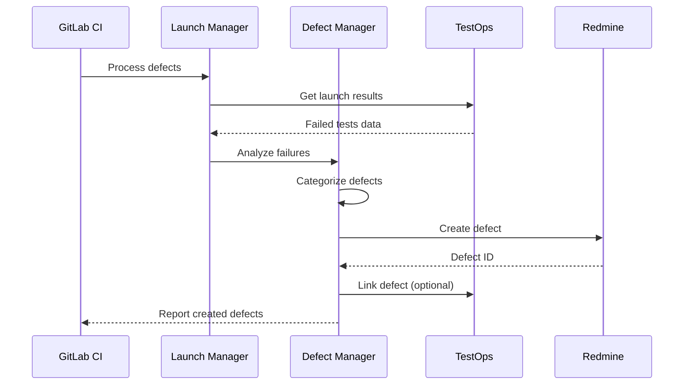

# 🔗 Интеграция с Redmine для автоматического создания дефектов

## Обзор

Реализована полная интеграция с Redmine для автоматического создания дефектов при обнаружении упавших тестов. Система включает интеллектуальный анализ ошибок, категоризацию дефектов и автоматическое создание задач в Redmine.

## Архитектура интеграции



## Компоненты системы

### 1. Defect Manager (`defect_manager.sh`)

Основной компонент для управления дефектами:

**Функции:**
- ✅ Автоматический анализ упавших тестов
- ✅ Интеллектуальная категоризация дефектов
- ✅ Создание дефектов в Redmine
- ✅ Связывание с TestOps launches
- ✅ Статистика и отчетность

**Команды:**
```bash
./defect_manager.sh process <launch_id> [name] [version] [commit] [url]  # Создать дефекты для упавших тестов
./defect_manager.sh test-redmine                                         # Тест Redmine подключения
./defect_manager.sh list [limit]                                         # Список recent QA дефектов
./defect_manager.sh stats [days]                                         # Статистика дефектов
./defect_manager.sh analyze <test> <error> <trace>                       # Анализ ошибки теста
```

### 2. Система категоризации дефектов

**Автоматическая категоризация по типу ошибки:**

| Тип ошибки | Категория | Приоритет | Серьезность |
|------------|-----------|-----------|-------------|
| Connection Failed, Timeout, Network | Network/Connection | High | Major |
| Assertion Failed, Expected but was | Logic/Assertion | Normal | Normal |
| Null Pointer, Segmentation Fault | Critical Error | Critical | Critical |
| File not found, Path not exist | Environment/Setup | High | Major |
| Permission denied, Access denied | Permissions | High | Major |

### 3. Конфигурация (`redmine_config.env`)

```bash
# Redmine Configuration
export REDMINE_URL="https://redmine.example.com"
export REDMINE_API_KEY="your-api-key"
export REDMINE_PROJECT_ID="1"

# Defect Creation Settings
export CREATE_DEFECTS_ON_FAILURE="true"
export MIN_FAILED_TESTS_FOR_DEFECT="1"
export DEFECT_TRACKER_ID="1"                     # Bug tracker
export DEFECT_DEFAULT_PRIORITY="3"               # Normal
export DEFECT_DEFAULT_STATUS="1"                 # New

# Categorization Settings
export ENABLE_AUTO_CATEGORIZATION="true"
export DEFECT_CATEGORY_PREFIX="[QA Defect]"
```

## Настройка интеграции с Redmine

### Шаг 1: Настройка Redmine API

1. **Включить REST API в Redmine:**
   - Администрирование → Настройки → API
   - Включить "Включить REST веб-сервис"

2. **Создать API ключ:**
   - Моя учетная запись → API ключ доступа
   - Показать → Скопировать ключ

3. **Получить ID проекта:**
   - Перейти в проект → Настройки
   - ID проекта отображается в URL или настройках

### Шаг 2: Настройка конфигурации

Обновить `redmine_config.env`:
```bash
export REDMINE_URL="https://your-redmine.com"
export REDMINE_API_KEY="your-api-key-here"
export REDMINE_PROJECT_ID="your-project-id"
```

### Шаг 3: Тестирование подключения

```bash
cd qa-tests
./defect_manager.sh test-redmine
```

### Шаг 4: Настройка CI/CD переменных

В GitLab CI/CD добавить переменные:
- `REDMINE_API_KEY` - API ключ Redmine
- `REDMINE_URL` - URL Redmine инстанса
- `REDMINE_PROJECT_ID` - ID проекта

## Интеграция с TestOps (по документации)

Согласно [официальной документации TestOps](https://docs.qatools.ru/integrations/issue-trackers/redmine), для полной интеграции:

### 1. Настройка в TestOps

1. **Добавить интеграцию:**
   - Администрирование → Интеграции
   - Добавить интеграцию → Redmine
   - Указать URL Redmine и название

2. **Включить для проекта:**
   - Указать учетные данные Redmine
   - Проверить соединение

### 2. Установка плагина в Redmine

1. **Скачать плагин:**
   - Получить архив с плагином TestOps

2. **Установить:**
   ```bash
   # Создать директорию
   mkdir $REDMINE/plugins/allure_testops
   
   # Распаковать архив
   unzip plugin.zip -d $REDMINE/plugins/allure_testops/
   
   # Перезапустить Redmine
   systemctl restart redmine
   ```

3. **Настроить плагин:**
   - Administration → Plugins → Allure TestOps → Configure
   - Указать URL TestOps и ID интеграции

## Формат создаваемых дефектов

### Заголовок
```
[QA Defect] {test_name} - {category} ({node_version})
```

### Описание
```markdown
## 🐛 Автоматически созданный дефект

### 📊 Информация о тесте
- **Тест**: test_cellframe_node_connection
- **Категория**: Network/Connection
- **Приоритет**: High
- **Серьезность**: Major
- **Версия ноды**: latest-amd64
- **Коммит**: abc123

### 🔍 Детали ошибки
```
Connection timeout after 30 seconds
```

### 🔗 Ссылки
- **TestOps Launch**: http://testops.example.com/launch/123
- **TestOps Project**: http://testops.example.com/project/1
- **GitLab Pipeline**: https://gitlab.example.com/project/-/pipelines/456

### 📋 Шаги для воспроизведения
1. Запустить тест: test_cellframe_node_connection
2. Использовать версию ноды: latest-amd64
3. Проверить окружение и конфигурацию

### 🎯 Критерии приемки
- [ ] Тест проходит успешно
- [ ] Ошибка не воспроизводится
- [ ] Добавлены дополнительные проверки (при необходимости)
```

## Workflow создания дефектов



## Мониторинг и статистика

### Команды для мониторинга

```bash
# Список recent дефектов
./defect_manager.sh list 10

# Статистика за неделю
./defect_manager.sh stats 7

# Тест подключения
./defect_manager.sh test-redmine
```

### Метрики дефектов

- **Total Defects** - общее количество дефектов
- **Open Defects** - открытые дефекты
- **Closed Defects** - закрытые дефекты
- **Resolution Rate** - процент решенных дефектов

## Преимущества системы

### 1. Автоматизация
- ✅ Автоматическое создание дефектов при падении тестов
- ✅ Интеллектуальная категоризация по типу ошибки
- ✅ Автоматическое заполнение всех полей дефекта

### 2. Интеграция
- ✅ Полная интеграция с Redmine API
- ✅ Связь с TestOps launches
- ✅ Интеграция с GitLab CI/CD pipeline

### 3. Информативность
- ✅ Подробная информация об ошибке
- ✅ Прямые ссылки на TestOps и Pipeline
- ✅ Контекст для быстрого исправления
- ✅ Шаги воспроизведения и критерии приемки

### 4. Управляемость
- ✅ Гибкая конфигурация приоритетов и категорий
- ✅ Возможность отключения автосоздания
- ✅ Настраиваемые пороги и фильтры

## Расширенные возможности

### 1. Кастомные поля Redmine

Можно добавить кастомные поля через конфигурацию:
```bash
export DEFECT_CUSTOM_FIELDS='{"custom_field_1": "value1", "custom_field_2": "value2"}'
```

### 2. Автоназначение дефектов

```bash
export DEFECT_AUTO_ASSIGN="true"
export DEFECT_ASSIGNEE_ID="123"  # ID пользователя в Redmine
```

### 3. Уведомления

```bash
export NOTIFY_ON_DEFECT_CREATION="true"
export NOTIFICATION_RECIPIENTS="dev@example.com,qa@example.com"
```

## Troubleshooting

### Частые проблемы

1. **"Redmine connection failed"**
   - Проверить URL и API ключ
   - Убедиться что REST API включен в Redmine

2. **"Permission denied"**
   - Проверить права пользователя в проекте
   - Убедиться что пользователь может создавать задачи

3. **"Project not found"**
   - Проверить правильность REDMINE_PROJECT_ID
   - Убедиться что проект существует и доступен

### Отладка

```bash
# Включить debug логи
export LOG_LEVEL="DEBUG"

# Тест анализа ошибки
./defect_manager.sh analyze "test_name" "error_message" "stack_trace"

# Проверка конфигурации
./test_defect_system.sh
```

## Заключение

Система автоматического создания дефектов в Redmine обеспечивает:

- **Быструю реакцию** на проблемы в тестах
- **Структурированное управление** дефектами
- **Полную трассируемость** от теста до исправления
- **Автоматизацию рутинных процессов** QA

Интеграция готова к использованию и может быть легко настроена под специфические требования проекта и процессы команды.

---
*Документ создан: 14.10.2025*  
*Автор: QA Automation System*  
*Версия: 1.0*
